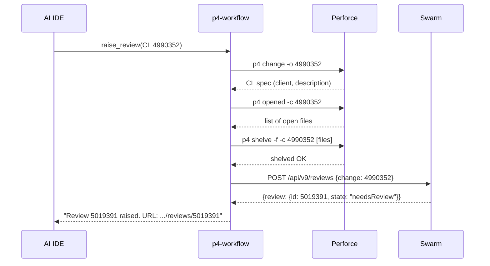
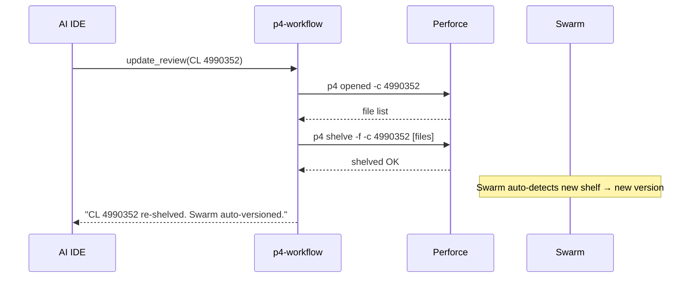
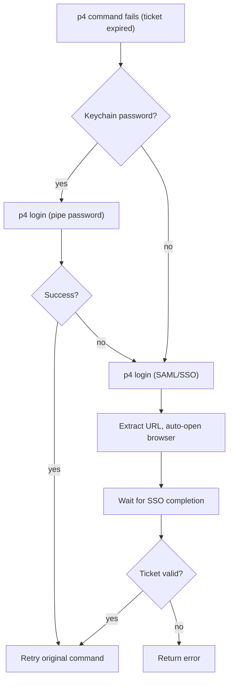
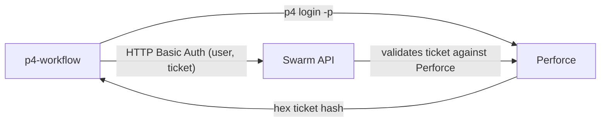

# Perforce + Swarm MCP Server

Give your AI-powered IDE native Perforce and Swarm code review capabilities — zero manual steps.

---

## What is MCP?

**Model Context Protocol** is an open standard that lets AI IDEs (Cursor, VS Code Copilot, Windsurf) call external tools. Instead of copy-pasting terminal output into chat, the AI calls the tool directly and gets structured results back.

| Without MCP | With MCP |
|---|---|
| Run `p4 describe` in terminal, copy output, paste into chat, ask AI to review it, copy feedback, go to Swarm, paste comment. | Say "review Swarm 5012947". The AI fetches the diff, analyzes it, and posts comments — all in one step. |

---

## Architecture

Two MCP servers run locally on your machine. The IDE talks to them over stdio. They talk to Perforce and Swarm on your behalf.

```mermaid
flowchart LR
  IDE["AI IDE<br/>(Cursor)"]
  PW["p4-workflow<br/><i>Python / FastMCP</i>"]
  PP["perforce-p4<br/><i>Official binary</i>"]
  P4["Perforce Server<br/><i>Helix Core</i>"]
  SW["Swarm Server<br/><i>Code Review</i>"]
  KC["macOS Keychain"]

  IDE -- "create CL, raise review,<br/>get diff, comment" --> PW
  IDE -- "query files, history,<br/>workspaces" --> PP
  PW -- "p4 CLI<br/>(subprocess)" --> P4
  PW -- "REST API<br/>(httpx)" --> SW
  PP -- "p4 CLI" --> P4
  PW -. "auto-login" .-> KC
```



| Server | Role |
|---|---|
| **p4-workflow** (custom) | Mutations and Swarm integration. Create CLs with Cisco template, shelve, raise reviews, fetch diffs, post comments. |
| **perforce-p4** (official) | Read-only depot queries. File content, history, annotations, workspace management, server info. |

---

## How `raise_review` Works

One tool call. Under the hood it coordinates three separate operations against two systems.



**Step 1 — Detect workspace**: `p4 change -o` reads the CL spec to find which P4CLIENT owns it — no need to pass workspace manually.

**Step 2 — Shelve files**: `p4 opened -c` lists all files in the CL, then `p4 shelve -f -c` force-shelves them. This is what Swarm reads.

**Step 3 — Create Swarm review**: A single `POST /api/v9/reviews` with the CL number and description. Swarm links the shelved files to the new review.

---

## How `update_review` Works

After making more code changes, one call re-shelves the files. Swarm auto-detects the new shelf and creates a new version.



---

## Authentication

Fully automatic. The user never runs `p4 login` manually.



For Swarm API calls, the ticket is obtained from `p4 login -p`, cached for 20 hours, and auto-refreshed on HTTP 401.

---

## Swarm API & Security

All Swarm interactions use the **official Swarm REST API v9** — the same API that Swarm's own web UI calls.

### API call: create a review

```
POST /api/v9/reviews
Auth: Basic (P4USER, p4_ticket_hash)
Body: {"change": 4990352, "description": "Fixes: [devseth CSCwt43076] ..."}
```

### How Swarm authentication works



The ticket is a hex hash from `p4 login -p`, not your actual password. Swarm validates it against Perforce. Cached for 20 hours, auto-refreshed on HTTP 401.

### Security boundaries

| Concern | How it's handled |
|---|---|
| Password storage | macOS Keychain only. Never written to disk, config files, or logs. |
| Swarm auth | P4 ticket hash over HTTPS — same as Swarm web UI. No raw password sent. |
| TLS verification | `verify=False` for internal self-signed cert. Traffic stays on corporate network (VPN required). |
| Blast radius | Can only shelve files in *your* CLs and create reviews owned by *your* user. Cannot submit, delete, or modify other users' reviews. |
| No undocumented APIs | All endpoints are from the official [Swarm API documentation](https://www.perforce.com/manuals/swarm/Content/Swarm/swarm-apidoc.html). |

---

## Tools

| Tool | What it does | Server |
|---|---|---|
| `create_changelist` | New CL with Cisco IMS template | p4-workflow |
| `checkout_file` | Open file for edit in a CL | p4-workflow |
| `raise_review` | Shelve + create Swarm review | p4-workflow |
| `update_review` | Re-shelve; Swarm auto-versions | p4-workflow |
| `get_review_diff` | Fetch full diff for any review | p4-workflow |
| `get_review_info` | Metadata + file list (no diff) | p4-workflow |
| `add_review_comment` | Post comment on a review | p4-workflow |
| `update_description` | Update CL description (no char limit) | p4-workflow |
| `query_files` | File content, history, annotations | perforce-p4 |
| `query_changelists` | Search/list changelists | perforce-p4 |
| `modify_files` | Add, edit, delete, revert files | perforce-p4 |

---

## Setup

```bash
git clone <repo>
cd p4v-swarm-mcp-server
./setup.sh
```

The script handles everything from a bare macOS machine: Homebrew, p4 CLI, Python, Node.js, dependencies, authentication, MCP config, and AI rules/skills. One command, restart the IDE, done.

---

## FAQ

**Does this modify any files on the Perforce server?**
Only when you explicitly ask it to (create CL, shelve, raise review). Read operations like `get_review_diff` are read-only.

**How does the AI know my Perforce password?**
It doesn't. The password is stored in macOS Keychain (one-time setup). The MCP server reads it from Keychain at runtime to refresh the P4 ticket. No passwords in config files or environment variables.

**What if I don't store a password in Keychain?**
SAML/SSO still works. When the ticket expires, your default browser opens the SSO page automatically. Complete the login, and the server continues — no copy-pasting URLs.

**Can I use this with VS Code / Windsurf / other IDEs?**
Any IDE that supports MCP. The config lives in `~/.cursor/mcp.json` — adjust the path for your IDE's config location.

**How does Swarm authentication work?**
Swarm accepts `(P4USER, p4_ticket)` as HTTP Basic Auth. The server runs `p4 login -p` to get a ticket hash, caches it for 20 hours, and auto-refreshes on 401.

**What's the difference between `raise_review` and `update_review`?**
`raise_review` shelves files and creates a new Swarm review (first time). `update_review` just re-shelves — Swarm auto-detects the new shelf and adds a version to the existing review.

**Does it work behind the Cisco VPN?**
Yes. It requires VPN to reach the Perforce server and Swarm. If the connection drops, the error message tells you to check VPN.

**Can the AI review someone else's code?**
Yes. `get_review_diff(review_id)` works for any review — yours or a colleague's. Just provide the Swarm URL.

**Can the AI submit my changelist (push to production)?**
No. There is no `p4 submit` tool. Code can only be submitted through the normal review and approval process.

**Does the AI see my password?**
No. The password lives in Keychain and is read by the Python server process at runtime — piped into `p4 login` and discarded. It never appears in the MCP protocol messages or the AI's context window.

**What happens if VPN drops mid-operation?**
The `p4` command fails, the server catches it, and returns a clear error. Nothing is left in a partial state. Shelving is atomic.

**What if my ticket expires mid-session?**
Transparent recovery. The server detects the auth error, tries Keychain (instant), retries the command. If Keychain isn't set up, it opens the browser for SSO, waits, and retries. You see the result, not the retry.
